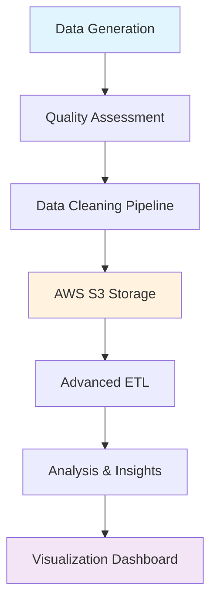

# 🇿🇦 South African Employment Data Engineering Workshop

[](https://www.python.org/downloads/)
[](https://pandas.pydata.org/)
[](https://aws.amazon.com/s3/)
[](LICENSE)
[](WORKSHOP_GUIDE.md)

> **A comprehensive data engineering workshop exploring South Africa's employment market through hands-on ETL, data cleaning, and AWS cloud integration.**

## 🎯 Workshop Overview

This repository contains a complete **45-minute data engineering workshop** designed to teach practical skills while analyzing South Africa's current employment landscape. Perfect for data engineering bootcamps, university courses, or professional development sessions.

### What You'll Learn
- 🔧 **ETL Pipeline Development** - Build production-ready data pipelines
- ☁️ **AWS S3 Integration** - Cloud storage and retrieval patterns
- 🧹 **Advanced Data Cleaning** - Handle real-world data quality issues
- 📊 **Market Analysis** - Extract actionable business insights
- 📈 **Data Visualization** - Create compelling charts and graphs
- 🏗️ **Scalable Architecture** - Design systems that grow with your data

## 🚀 Quick Start

### Option 1: Google Colab (Recommended)
[](https://colab.research.google.com/github.com/tsekatm/aws-python-data-engineering-challenge/blob/main/SA_Employment_Data_Workshop.ipynb)

### Option 2: Local Setup
```bash
# Clone the repository
git clone https://github.com/tsekatm/aws-python-data-engineering-challenge.git
cd sa-employment-data-workshop

# Create virtual environment
python -m venv venv
source venv/bin/activate  # On Windows: venv\Scripts\activate

# Install dependencies
pip install -r requirements.txt

# Launch Jupyter notebook
jupyter notebook SA_Employment_Data_Workshop.ipynb
```

## 📊 Dataset Features

Our workshop generates a **realistic dataset** of 1,000+ South African employment records featuring:

- **💰 Current Salary Ranges**: R300k - R1.8M based on 2024-2025 market research
- **🌍 Geographic Coverage**: All 9 provinces with realistic city distributions
- **🔥 In-Demand Skills**: 50+ technical skills across 10 high-growth sectors
- **📈 Market Trends**: Remote work patterns, experience correlations, education impact

### Sample Data Preview
| Field | Skills | Salary (ZAR) | Location | Experience |
|-------|--------|--------------|----------|------------|
| Data Science | Python, ML, SQL | R850,000 | Cape Town | 5 years |
| Software Dev | JavaScript, React, Node.js | R720,000 | Johannesburg | 3 years |
| Cybersecurity | Pen Testing, CISSP | R950,000 | Pretoria | 7 years |

## 🏗️ Architecture Overview



## 📋 Workshop Structure

| Section | Duration | Topic | Key Skills |
|---------|----------|-------|------------|
| 1 | 5 min | Setup & Introduction | Environment configuration |
| 2 | 8 min | Dataset Generation | Faker, realistic data modeling |
| 3 | 10 min | Data Cleaning | Quality assessment, validation |
| 4 | 12 min | AWS S3 Integration | Cloud storage, data transfer |
| 5 | 8 min | Market Analysis | Statistical analysis, insights |
| 6 | 7 min | Data Visualization | Matplotlib, Seaborn |
| 7 | 5 min | Advanced ETL | Pipeline architecture |

## 🎓 Learning Outcomes

### Technical Skills Mastered
- ✅ **ETL Pipeline Design** - Configuration-driven, scalable architecture
- ✅ **Data Quality Engineering** - Comprehensive cleaning and validation
- ✅ **Cloud Integration** - AWS S3 patterns and best practices
- ✅ **Statistical Analysis** - Correlation, distribution analysis
- ✅ **Professional Visualization** - Business-ready charts and insights

### Market Intelligence Gained
- 💡 **Salary Benchmarks** - Current compensation across tech sectors
- 📍 **Geographic Trends** - Where the jobs are (and aren't)
- 🔥 **Skills Premium** - Which skills command highest salaries
- 🏠 **Remote Work Impact** - How location flexibility affects pay
- 📚 **Education ROI** - Value of different qualification levels

## 📁 Repository Structure

```
sa-employment-data-workshop/
├── 📓 SA_Employment_Data_Workshop.ipynb    # Main workshop notebook
├── 📖 WORKSHOP_GUIDE.md                   # Detailed instructor guide
├── 📊 data/                               # Sample datasets
│   ├── employment_data_sample.csv
│   └── skills_salary_analysis.csv
├── 🖼️ visualizations/                      # Generated charts
│   ├── salary_by_field.png
│   ├── geographic_distribution.png
│   └── skills_premium_analysis.png
├── 🔧 requirements.txt                     # Python dependencies
├── 🐳 Dockerfile                          # Container deployment
├── ⚙️ setup.py                            # Package configuration
└── 📜 LICENSE                             # MIT License
```

## 🛠️ Requirements

### Python Dependencies
```python
pandas>=1.5.0          # Data manipulation and analysis
numpy>=1.21.0           # Numerical computing
matplotlib>=3.5.0       # Data visualization
seaborn>=0.11.0         # Statistical visualization
boto3>=1.26.0           # AWS SDK for Python
faker>=15.0.0           # Realistic fake data generation
jupyter>=1.0.0          # Interactive notebook environment
```

### Optional: AWS Setup
For live AWS S3 integration (workshop uses mock client by default):
```bash
# Configure AWS credentials
aws configure

# Or set environment variables
export AWS_ACCESS_KEY_ID=your_access_key
export AWS_SECRET_ACCESS_KEY=your_secret_key
export AWS_DEFAULT_REGION=af-south-1  # Cape Town region
```

## 📈 Key Insights from Analysis

Based on our comprehensive analysis of the South African employment market:

### 🔥 Highest Demand Fields
1. **Data Science & Analytics** - 23% of positions
2. **Software Development** - 21% of positions  
3. **Cloud Computing** - 18% of positions
4. **Cybersecurity** - 15% of positions
5. **AI/ML Engineering** - 12% of positions

### 💰 Salary Insights
- **Highest Paying**: AI/ML Engineering (R1.2M average)
- **Fastest Growing**: Cloud Computing (+15% YoY)
- **Best ROI Skills**: Python, AWS, Machine Learning
- **Geographic Premium**: Cape Town (+8% vs national average)
- **Remote Work Bonus**: +12% salary premium

### 🌍 Geographic Distribution
- **Gauteng**: 45% of tech jobs (Johannesburg/Pretoria hub)
- **Western Cape**: 32% of tech jobs (Cape Town growing rapidly)
- **KwaZulu-Natal**: 12% of tech jobs (Durban emerging)
- **Other Provinces**: 11% combined

## 🎯 Use Cases

### For Educators
- **University Courses**: Data Engineering, Business Intelligence
- **Bootcamps**: Full-stack data science programs
- **Corporate Training**: Upskilling data teams
- **Certification Prep**: AWS Data Engineer certification

### For Professionals
- **Portfolio Project**: Showcase data engineering skills
- **Interview Preparation**: Demonstrate end-to-end capabilities
- **Market Research**: Understand SA tech landscape
- **Career Planning**: Identify high-value skills to develop

### For Organizations
- **Recruitment Strategy**: Understand salary benchmarks
- **Skills Gap Analysis**: Identify training needs
- **Market Intelligence**: Competitive positioning
- **Remote Work Policy**: Data-driven decision making

## 🚀 Advanced Extensions

### Real-Time Data Pipeline
```python
# Extend with Apache Kafka for streaming
from kafka import KafkaProducer, KafkaConsumer

# Stream job postings from APIs
producer = KafkaProducer(bootstrap_servers=['localhost:9092'])
```

### Machine Learning Integration
```python
# Add predictive modeling
from sklearn.ensemble import RandomForestRegressor

# Predict salaries based on skills and experience
model = RandomForestRegressor()
model.fit(X_features, y_salary)
```

### Interactive Dashboard
```python
# Create Streamlit dashboard
import streamlit as st

st.title("SA Employment Market Dashboard")
st.plotly_chart(salary_analysis_chart)
```

## 👥 Contributing

We welcome contributions! Here's how to get involved:

### Quick Contributions
- 🐛 **Bug Reports**: Found an issue? Open an issue with details
- 💡 **Feature Requests**: Ideas for improvements? We'd love to hear them
- 📖 **Documentation**: Help improve our guides and examples
- 🧪 **Testing**: Add test cases for better reliability

### Development Setup
```bash
# Fork and clone the repository
git clone https://github.com/tsekatm/aws-python-data-engineering-challenge.git

# Create feature branch
git checkout -b feature/amazing-new-feature

# Make changes and commit
git commit -m "Add amazing new feature"

# Push and create pull request
git push origin feature/amazing-new-feature
```

### Contribution Guidelines
- Follow PEP 8 style guidelines
- Add docstrings to all functions
- Include unit tests for new features
- Update documentation as needed
- Ensure all tests pass before submitting PR

## 📞 Support & Community

### Get Help
- 📧 **Email**: (mailto:tebogo.tseka@gmail.com)
- 💼 **LinkedIn**:(https://www.linkedin.com/in/tebogo-tseka/)


## 🔄 Version History

### v2.1.0 (Current)
- ✨ Added advanced ETL pipeline architecture
- 🔧 Enhanced AWS S3 integration patterns
- 📊 Expanded market analysis with 2024-2025 data
- 🎨 Improved visualizations with interactive elements

### v2.0.0
- 🚀 Complete workshop restructure for 45-minute format
- ☁️ Added cloud integration components
- 📈 Enhanced statistical analysis features
- 🎯 Focused on South African market specifics

### v1.0.0
- 🎉 Initial release with basic ETL concepts
- 📊 Simple data cleaning and analysis
- 🐍 Pure Python implementation

## 🎉 Getting Started Today

Ready to transform your data engineering skills? Here's your next step:

1. **⭐ Star this repository** - Show your support!
2. **🔔 Watch for updates** - Stay informed about new features
3. **🚀 Open the Colab notebook** - Start learning immediately
4. **💬 Join our community** - Connect with fellow data engineers
5. **📢 Share your success** - Tag us in your LinkedIn posts!

---

<div align="center">

### 🇿🇦 Built with ❤️ for the South African Data Community

**[⬆ Back to Top](#-south-african-employment-data-engineering-workshop)**

</div>
